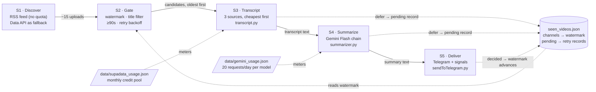
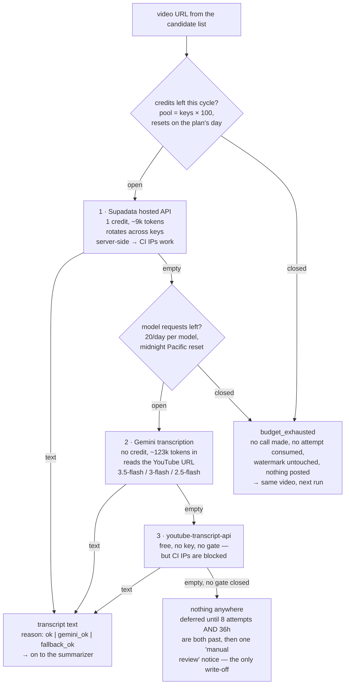
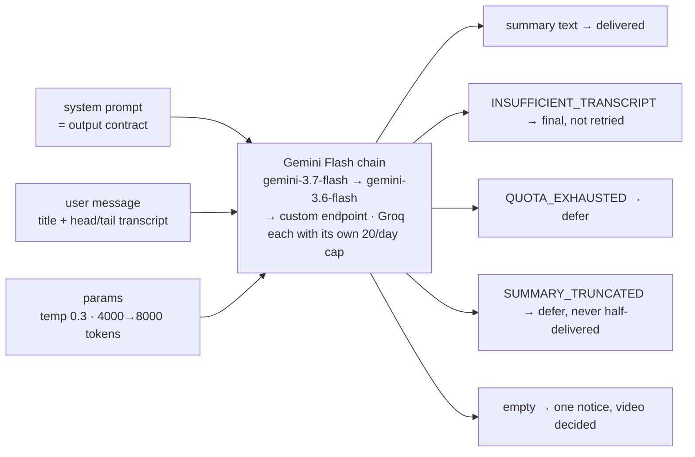
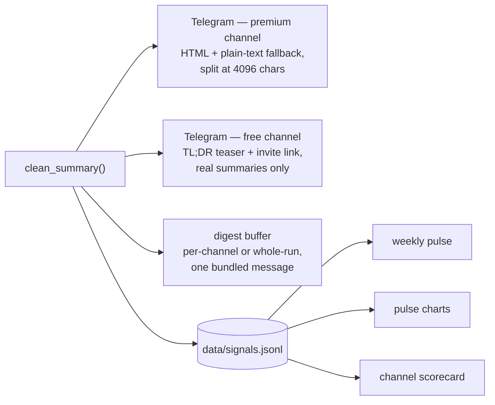

# Architecture — from a YouTube upload to a Telegram summary

**Status:** descriptive (what the code does today), for review
**Date:** 2026-09-05
**Scope:** the daily-summary path — discovery, transcript acquisition,
summarization with Gemini Flash, and everything downstream of a finished
summary. The two weekly market jobs appear only as consumers.

A visual version of this document (the same four figures, laid out for reading)
is published as an artifact:
<https://claude.ai/code/artifact/82f1dcea-bce4-401d-903e-8517a117e6a4>

---

## 1. The run, end to end

`scraper.py::main()` loops over `channel_ids.txt`. For each channel it lists
recent uploads, filters them down to undecided ones, and processes each
candidate in publish order. Two stages spend a metered resource; everything
before them exists to keep worthless work away from them.

Schedule: `.github/workflows/daily-summary.yml` runs every two hours from 12:00
to 22:00 UTC plus two overnight catch-ups (02:00, 07:00) — seven runs a day.

---

## 2. S1–S2 — deciding which videos are worth money

Discovery reads the channel's public RSS feed (no key, no API quota, last ~15
uploads). The YouTube Data API is the fallback for a feed that won't fetch or
parse, and it returns only the latest video, so a run degrades rather than
fails.

Every S2 filter runs **before** a credit is spent:

- **Watermark** — per channel, the last decided video's publish time; only
  videos published after it are candidates, oldest first. A brand-new channel
  yields only its latest video, so adding a channel never floods Telegram with
  its back catalogue.
- **Pending re-entry** — videos deferred earlier are pulled back in while still
  in the feed; records for videos that dropped out of the feed are evicted.
- **Title filter** (`only=`) — whole-word match on the title, applied to the
  feed, so filtered videos cost nothing and the watermark moves past them.
- **Duration gate** — one batched `videos.list` call (1 quota unit per 50 ids)
  screens out anything under `MIN_VIDEO_SECONDS` (90s). Videos whose metadata
  can't be read are kept: a lookup failure must never drop content.
- **Retry backoff** — a video retried within `PENDING_RETRY_MIN_HOURS` (3h) is
  skipped, so a fast schedule can't burn a video's give-up attempts in one
  afternoon.

---

## 3. S3 — getting the transcript

`transcript.get_transcript_from_video()` tries three sources in strict cost
order and always returns `{"transcript", "budget_exhausted", "reason"}`. It
never raises. `reason` lets a run report *why* fetches failed rather than only
how often; `budget_exhausted` separates "we chose not to spend" from "this video
has no captions" — the distinction the whole design hinges on.

| Source | Cost | Why it exists | `reason` |
| --- | --- | --- | --- |
| Supadata | 1 credit from a monthly pool (keys × 100), paced over the billing cycle | Hosted, server-side caption fetch — the only source that reliably works from a GitHub Actions runner | `ok` |
| Gemini from the URL | 1 request from a per-model daily 20, plus ~123k input tokens | Free capacity for videos with no captions at all; its model pool is kept **disjoint** from the summary pool | `gemini_ok` |
| youtube-transcript-api | nothing | Works locally and in dev; kept as the last resort even though CI IPs are blocked | `fallback_ok` |

**The invariant worth reviewing.** A spent budget must never look like a missing
transcript. When Supadata's credits ran out in August 2026 the pipeline went
quiet for two days while every scheduled run still exited green. Hence:
`budget_exhausted` is its own field, deferrals of that kind consume no attempt
and stamp no retry timestamp, and a run that delivers nothing because every
source is spent posts its own "delivery stalled" alert
(`scraper._alert_delivery_stalled`).

Measured cost, `docs/tdd-transcript-budget.md`: ≈2.9 Supadata credits per
delivered summary before the step-1/2 work, 1.0 after.

---

## 4. S4 — the summarizer, and how Gemini Flash is instructed

Summarization goes through an OpenAI-compatible `chat/completions` call, so the
provider is swappable; in practice it is Google's Gemini Flash. The chain is
`GEMINI_MODEL` (`gemini-3.7-flash`) then `GEMINI_FALLBACK_MODELS`
(`gemini-3.6-flash`) — each entry is a **separate daily quota**, so the fallback
list is extra capacity, not just insurance against a bad model id. A custom
OpenAI-compatible endpoint and Groq join the chain when their keys are set.

The model receives three things.

**1. A system prompt that is really an output contract**
(`summarizer.SUMMARY_SYSTEM_PROMPT`):

- line 1 — a TL;DR giving the speaker's *actual call*, not the topic;
- a blank line, then 3–5 `• ` bullets carrying the reasoning and thesis;
- a blank line, then **one line per asset**:
  `TICKER (Name) — stance, conviction | levels/targets | timeframe`.

Plus the rules that make the output safe to forward: plain text only (Telegram
HTML-escapes the body, so markdown would render as literal asterisks); always
English; never invent a number, name or ticker; give a ticker only when the
speaker says it; under ~3000 characters, and when running long cut bullets
before ever dropping an asset line. A refusal has a defined shape too — the
single token `INSUFFICIENT_TRANSCRIPT`, so the code can detect it instead of
forwarding a refusal sentence as if it were a summary.

`COMPACT_SUMMARY_SYSTEM_PROMPT` is the same contract on a tighter budget, used
for digest-mode channels whose entries are skimmed several at a time.

**2. A user message** — `"Video title: …"` (grounding) followed by the
transcript. Past `LLM_MAX_TRANSCRIPT_CHARS` (120k) the **middle** is dropped,
keeping ~60% head and ~40% tail: a market video opens with the setup and closes
with the targets and invalidation levels, so a head-only cut would discard
exactly what the summary exists to capture.

**3. Request parameters** — `temperature` 0.3, `max_tokens` 4000 doubling toward
8000 when a response comes back cut off, `reasoning_effort` low (dropped and
retried if a provider rejects it), and `response_format: json_object` for the
combined summary+signals call.

**One call, two products.** When `MARKET_SIGNALS` is on (default),
`signals.summarize_with_signals()` asks for the summary and the structured
signals in a single JSON-mode call. If the envelope comes back unusable the code
falls back to the two separate calls — a format hiccup must never cost a summary.

---

## 5. What each outcome does to the video

"Decided" means the watermark advances and the video is finished; anything else
comes back on the next run.

| Outcome | Cause | Sent to Telegram | Decided? | Counts toward give-up |
| --- | --- | --- | --- | --- |
| `sent` | summary produced | full summary (or a digest entry) | yes | — |
| `budget_deferred` | every metered transcript source spent | nothing — silent | no | no |
| `no_transcript_deferred` | no captions yet, inside 8 attempts / 36h | nothing — silent | no | yes |
| `quota_deferred` | all LLM providers rate-limited | one notice per run | no | no |
| `truncated_deferred` | response cut off at the cap after escalation | one notice per run | no | yes |
| `retry_backoff` | retried less than 3h ago | nothing | no | no |
| `no_transcript` | 8 attempts **and** 36h exhausted | "manual review needed" | yes | — |
| `insufficient` | model judged the transcript unusable | "too garbled to summarize" | yes | — |
| `truncated` | still truncated after 8 runs | "no complete summary" | yes | — |
| `summary_failed` | transcript existed, model returned nothing | "summarization produced no output" | yes | — |

Two rules follow, and both are easy to break in a refactor:

1. Returning `""` from the summarizer means **permanent failure** and advances
   the watermark, so every retryable condition must return a sentinel instead.
2. A deferral that cost no credit must not stamp a retry timestamp, or a
   budget-deferred video serves out a 3-hour wait it never earned.

---

## 6. S5 — after the summary

Delivery and the research dataset are independent consumers of the same summary,
and the weekly jobs read `signals.jsonl` on their own schedules — so a failed
teaser send or a bad signal extraction degrades one branch without touching the
other. `seen_videos.json` is saved after **every** video, so a mid-run crash
never re-sends what was already delivered.

---

## 7. Design invariants to hold in review

- **Cheap filters before expensive calls.** Title filter and duration gate run
  against feed metadata; the batched details call costs 1 quota unit per 50
  videos and saves a credit per Short.
- **Model pools stay disjoint.** Transcription uses 3.5-flash / 3-flash /
  2.5-flash; summaries use 3.7-flash / 3.6-flash. Overlap lets video
  transcriptions eat the summary budget, and the pipeline goes quiet with quota
  left on paper (`docs/tdd-gemini-transcripts.md`).
- **Failures never raise.** Every network path returns `""`/`None` and logs; one
  channel's exception is caught so the rest of the batch still runs.
- **A per-day 429 verdict is provisional.** The API has been observed writing a
  model off after three requests, so a spent verdict is honoured for
  `GEMINI_SPENT_RECHECK_MINUTES` (45, doubling) and then re-probed. Only the
  locally counted 20/day is final.
- **State is written per video, not per run.**

## 8. Open questions for this review

1. **Is the credit-per-summary ratio acceptable?** Most of the loss is
   transcripts fetched for videos that then defer or fail. Tightening the gates
   trades coverage for credits.
2. **Should Gemini transcription move ahead of Supadata?** It costs no credit
   but ~123k input tokens and a request from a 20/day pool. The current order
   optimises for the scarcer resource — is that still the right scarcity?
3. **Is 8 attempts × 36 hours the right write-off?** At seven runs a day the
   count is reached within a day but the clock forces a day and a half.
4. **Does the combined summary+signals call risk the summary?** One call is
   cheaper, but a malformed envelope costs a retry through the plain path. How
   often does the fallback actually fire?
