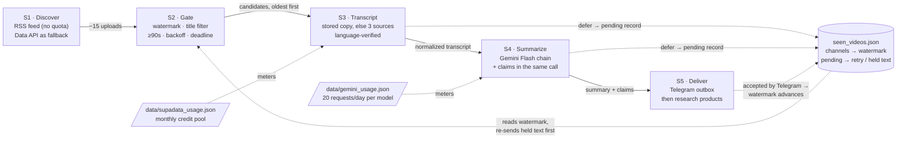
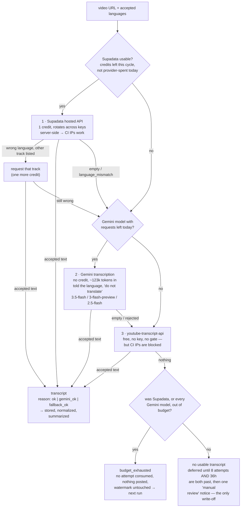
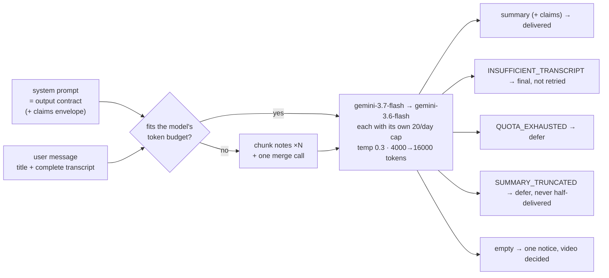
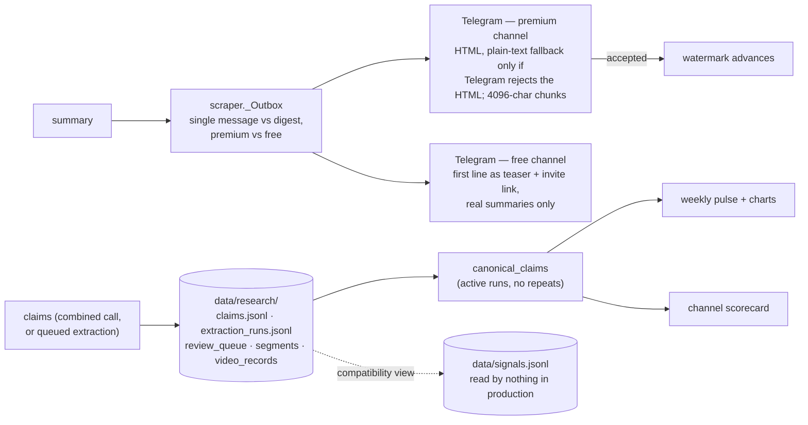

# Architecture — from a YouTube upload to a Telegram summary

**Status:** descriptive (what the code does today), for review
**Date:** 2026-09-25
**Scope:** the daily-summary path — discovery, transcript acquisition,
summarization with Gemini Flash, delivery, and the research products written
after a summary. The weekly jobs appear only as consumers of those products.
Deep dives live in the TDDs linked from each section.

---

## 1. The run, end to end

`scraper.py::main()` loops over `channel_ids.txt`. For each channel it lists
recent uploads, filters them down to undecided ones, and processes each
candidate oldest first. Two stages spend a metered resource; everything before
them exists to keep worthless work away from them.

**Schedule** (`.github/workflows/daily-summary.yml`): every two hours from 12:00
to 22:00 UTC plus two overnight catch-ups at 02:00 and 07:00 — **eight runs a
day**. The job has a 45-minute timeout and the scraper stops starting new
videos after `RUN_DEADLINE_MINUTES` (35); the rest defer as `deadline_deferred`.

After `python scraper.py`, the job runs `research_backfill.py
--reject-foreign-transcripts --refetch` (retire stored captures in the wrong
language and re-capture up to `RESEARCH_REFETCH_MAX_VIDEOS`, 3), then
`research_backfill.py --retry` (pending/failed research from stored
transcripts), and finally commits the state files (`if: always()`).

---

## 2. S1–S2 — deciding which videos are worth money

Discovery reads the channel's public RSS feed (no key, no API quota, last ~15
uploads). The YouTube Data API is the fallback for a feed that won't fetch or
parse, and it returns only the latest video, so a run degrades rather than
fails.

Before any new work, **held undelivered summaries are re-sent** from the text
kept in `pending[video]["undelivered"]` — no transcript, no LLM call (outcome
`redelivered`). Then every filter below runs **before** a credit is spent:

- **Watermark** — per channel, the last decided video's publish time; only
  videos published after it are candidates, oldest first. A brand-new channel
  yields only its latest video, so adding a channel never floods Telegram with
  its back catalogue. Per-channel `max=N` or `MAX_VIDEOS_PER_RUN` caps a run
  (default 0 = no cap).
- **Title filter** (`only=`) — whole-word match on the title, applied to the
  feed, so filtered videos cost nothing and the watermark moves past them.
- **Duration gate** — one batched `videos.list` call (1 quota unit per 50 ids)
  screens out anything under `MIN_VIDEO_SECONDS` (90s). Videos whose metadata
  can't be read are kept: a lookup failure must never drop content. The
  optional `SKIP_UNCAPTIONED` (off by default) also drops videos whose caption
  flag is false.
- **Pending re-entry and eviction** — deferred videos still in the feed are
  pulled back in; records for videos that left the feed (or were filtered out
  above) are evicted, **except** a record holding an undelivered summary.
- **Run deadline** — past `RUN_DEADLINE_MINUTES`, remaining videos defer as
  `deadline_deferred` without being touched.
- **Retry backoff** — a video retried within `PENDING_RETRY_MIN_HOURS` (3h) is
  skipped, so a fast schedule can't burn a video's give-up attempts in one
  afternoon.

Every gate decision is also logged to `data/research/gate_outcomes.jsonl`.

---

## 3. S3 — getting the transcript

### 3.1 Stored copy first

`scraper._stored_transcript` runs at the start of **every** attempt. If an
earlier attempt already captured this video (typically one that then hit
`quota_deferred` or `truncated_deferred`), the stored transcript is reused —
after **re-verifying its language** — instead of spending a second request.
Reason `stored`.

### 3.2 The source cascade

Otherwise `transcript.get_transcript_from_video(url, languages)` tries three
sources in strict cost order. It never raises and always returns
`{transcript, budget_exhausted, reason, language, language_check}`.
`budget_exhausted` — set when Supadata's budget *or* every Gemini model's quota
is spent, and no source produced text — separates "we chose not to spend" from
"this video has no usable captions": the distinction the whole design hinges on.

**Every source's text must be in the channel's language.** YouTube keeps
translated and auto-dubbed caption tracks beside the original, and in
September 2026 Supadata served Arabic for English videos and English for German
ones. `language_detect.verify_language` checks the provider's tag, the writing
system and stop-word statistics against the channel's `lang=` option (default
`TRANSCRIPT_LANGUAGES` = `en,de`).

| Source | Cost | Why it exists | `reason` |
| --- | --- | --- | --- |
| Stored copy | nothing | A retry must not pay twice for a transcript it already has | `stored` |
| Supadata | 1 credit from a monthly pool (keys × `SUPADATA_CREDITS_PER_KEY`, 100); a language swap costs one more | Hosted, server-side caption fetch — the only caption source that reliably works from a GitHub Actions runner | `ok` |
| Gemini from the URL | 1 request from a per-model daily 20, plus ~123k input tokens | Transcribes the audio itself, so it covers videos with no captions *and* videos whose only captions are in the wrong language; its model pool is kept **disjoint** from the summary pool | `gemini_ok` |
| youtube-transcript-api | nothing | Works locally and in dev; kept as the last resort even though CI IPs are blocked | `fallback_ok` |

Failure reasons are reported per run (`Transcript failures by reason: …`):
`language_mismatch`, `no_credits`, `budget_paced`, `empty_content`,
`gemini_quota`, `gemini_too_large`, `gemini_too_short`, `gemini_http_<status>`
and others — see `transcript.py`.

**Budget details worth knowing.**
- Daily pacing is **off** by default (`SUPADATA_DAILY_PACING`): a run may spend
  whatever the billing cycle has left, so today's videos are summarized today.
  The cycle follows the plan's reset day (`SUPADATA_RESET_DAY`), not the 1st.
- The local meter and the plan can disagree (September 2026: every key answered
  `limit-exceeded` with 184 local credits "left"). So once **every** key reports
  its plan limit, the verdict is remembered (`provider_spent`) and Supadata is
  skipped for the rest of that UTC day; the first video of each later day
  re-probes it. A served request, a changed key set or a new cycle clears it.

### 3.3 After a transcript arrives

- **Persisted raw** — gzip'd under `data/transcripts/`, indexed in
  `data/research/transcript_records.jsonl`, hash-idempotent (when
  `PERSIST_TRANSCRIPTS` and `MARKET_SIGNALS` are on — both default on).
- **Normalized** (`transcript_normalize.py`) — formatting only: line endings,
  timestamp/index lines, repeated caption cues, rolling auto-caption overlap,
  whitespace. An offset map back to the raw text is kept so claim evidence
  traces to the source.

**The invariant worth reviewing.** A spent budget must never look like a missing
transcript. When Supadata's credits ran out in August 2026 the pipeline went
quiet for two days while every scheduled run still exited green. Hence
`budget_exhausted` is its own field, deferrals of that kind consume no attempt
and stamp no retry timestamp, and a run that sends nothing while deferring for
budget posts its own "delivery stalled" alert (`scraper._alert_delivery_stalled`).

Deep dives: `docs/tdd-transcript-budget.md`, `docs/tdd-gemini-transcripts.md`.

---

## 4. S4 — the summarizer, and how Gemini Flash is instructed

### 4.1 Who answers

Summarization goes through an OpenAI-compatible `chat/completions` call.
`_provider_configs()` builds the chain in this order — a custom `LLM_*`
endpoint, then the Gemini models, then Groq — and then filters it through the
`SUMMARY_MODELS` allowlist, whose default is exactly
**`gemini-3.7-flash,gemini-3.6-flash`**. So in production the summarizer is
Gemini Flash only; a custom endpoint or Groq takes part only if `SUMMARY_MODELS`
is changed to include it (or set to `*`).

`gemini-3.7-flash` (`GEMINI_MODEL`) is tried first and `gemini-3.6-flash`
(`GEMINI_FALLBACK_MODELS`) second. Each is a **separate 20-requests/day
free-tier bucket**, so the fallback is capacity, not just insurance. A model
already spent today — or rate-limited earlier in this run — is skipped without
a request.

### 4.2 What it is told

**1. A system prompt that is really an output contract**
(`summarizer.SUMMARY_SYSTEM_PROMPT`):

- line 1 — a TL;DR giving the speaker's *actual call*, not the topic;
- a blank line, then 3–5 `• ` bullets carrying the reasoning and thesis;
- a blank line, then **one line per asset**, passing mentions included:
  `TICKER (Name) — stance, conviction | levels/targets | timeframe`.

Plus the rules that make the output safe to forward: plain text only (Telegram
HTML-escapes the body, so markdown would render as literal asterisks); always
English; attribute views to the speaker rather than stating them as fact; never
invent a number or name; give a ticker only when the speaker says it or the
title shows it; capture disclosed position changes (bought, sold, trimmed,
added); aim for under 3000 characters, and when running long cut bullets
before ever dropping an asset line. A refusal has a defined shape too — the
single token `INSUFFICIENT_TRANSCRIPT` — so the code can detect it instead of
forwarding a refusal sentence as if it were a summary.

`COMPACT_SUMMARY_SYSTEM_PROMPT` is the same contract on a tighter budget
(1–2 bullets, `TICKER — stance | level/target | invalidation`, ~1500
characters), used for channels marked `digest`.

**2. A user message** — `"Video title: …"` (grounding) followed by
`"Summarize the following transcript:"` and the **complete** normalized
transcript. There is no character cap and no head/tail cut any more.

**3. Request parameters** — `temperature` 0.3; `max_tokens` 4000
(`SUMMARY_MAX_OUTPUT_TOKENS`), doubled up to twice (→ 8000 → 16000) when the
response is cut off, each doubling a separate metered request;
`reasoning_effort` low, dropped and retried if a provider rejects it;
`response_format: json_object` for the combined call.

### 4.3 When the transcript doesn't fit

Before anything is sent, `token_budget` measures the exact request (Gemini
`countTokens` when available, else 3 chars/token) against the model's own
limits (`model_capabilities`):
`min(input_limit, context − output, TPM − output) − 2048` safety margin.

If it doesn't fit, the transcript is summarized in **complete-coverage
chunks** (`_summarize_chunked`): overlapping chunks (≈300 tokens overlap, at
most 12 chunks), one JSON "notes" call per chunk, then one merge call that
writes the final summary from all parts using the normal summary prompt. The
whole job is quota-checked before it starts (chunks + 1 requests must be
available), and finished chunks are cached under `data/research/partials/` so
a deferred video resumes where it stopped.

Deep dive: `docs/tdd-full-transcript-claims.md`.

### 4.4 One call, two products

When `MARKET_SIGNALS` is on (default), `signals.summarize_with_signals()` asks
for the summary **and** the research claims in one JSON-mode call (8000 output
tokens, escalating to 32000). The two products are validated independently:

- claims array malformed → the summary is still delivered; research is
  recorded `failed_retryable` for the retry job;
- response truncated by its claims array → a summary-only call is made and
  delivered, and the claims are extracted separately after all deliveries
  (never deferring the video);
- envelope unparseable → fall back to the separate calls. A format hiccup must
  never cost a summary.

`summarize_transcript` returns `QUOTA_EXHAUSTED` whenever any provider was
skipped or hit for quota — including when no provider is usable at all, so a
misconfiguration costs a delay, never a summary. `INPUT_TOO_LARGE` is internal:
it routes to the chunked path and never reaches the scraper.

---

## 5. What each outcome does to the video

"Decided" means final. **A decided video only advances the watermark once
Telegram accepts the message**; if the send fails, the finished text is held in
`pending` and re-sent next run (`redelivered`) — never regenerated.

| Outcome | Cause | Sent to Telegram | Decided? | Counts toward give-up |
| --- | --- | --- | --- | --- |
| `sent` | summary produced | full summary (or a digest entry), plus a teaser if the free channel is set | yes, once accepted | — |
| `redelivered` | a held text from an earlier failed send | the held text | yes, once accepted | — |
| `budget_deferred` | every metered transcript source spent | nothing — silent | no | no |
| `no_transcript_deferred` | no usable transcript, inside 8 attempts / 36h | nothing — silent | no | yes |
| `quota_deferred` | all summary providers rate-limited or spent | "⏳ Summary deferred" — once per run | no | no |
| `truncated_deferred` | cut off at the cap after escalation | "⏳ Summary deferred" — once per run | no | yes |
| `retry_backoff` | retried less than 3h ago | nothing | no | no |
| `deadline_deferred` | run passed `RUN_DEADLINE_MINUTES` | nothing | no | no |
| `no_transcript` | 8 attempts **and** 36h exhausted | "⚠️ … manual review needed" | yes, once accepted | — |
| `insufficient` | model judged the transcript unusable | "⚠️ … too garbled to summarize" | yes, once accepted | — |
| `truncated` | still truncated after 8 attempts | "⚠️ … kept coming back cut short" | yes, once accepted | — |
| `summary_failed` | transcript existed, model returned nothing | "⚠️ … produced no output" | yes, once accepted | — |

`delivery_failed` is counted *on top of* one of the decided outcomes when its
send was rejected. `unchanged`, `no_video` and `error` are per-channel tallies,
not per-video outcomes.

Two rules follow, and both are easy to break in a refactor:

1. An empty summary (`""`) is a **permanent failure** — the video is decided
   with a notice. Every retryable condition must therefore come back as a
   sentinel (`QUOTA_EXHAUSTED`, `SUMMARY_TRUNCATED`), never as `""`.
2. A deferral that cost no credit (`budget_deferred`, `quota_deferred`) must
   not stamp a retry timestamp, or the video serves out a 3-hour wait it never
   earned.

---

## 6. S5 — after the summary

- **Delivery** goes through `scraper._Outbox`, the one place that decides
  single message vs digest (per-channel `digest`, or whole-run `DAILY_DIGEST`)
  and premium vs free. Teasers go out only after the premium send succeeds and
  never affect the video's outcome.
- **Research** comes free with the combined call and is recorded immediately.
  When a separate extraction is needed, it is **queued until every video in the
  run has been delivered**, then run only if the summary budget keeps
  `SUMMARY_REQUEST_RESERVE` (4) requests in hand (`research_budget.py`);
  otherwise it waits for `research_backfill.py --retry`.
- **The weekly jobs read canonical claims**, not `signals.jsonl`:
  `market_pulse` (and the charts it drives) and `channel_scorecard` both load
  through `canonical_claims`. `data/signals.jsonl` is still appended — derived
  from validated claims — as a backward-compatible view; the legacy paths
  (`PULSE_DATA_SOURCE=legacy`, `channel_scorecard.py --legacy`) are the only
  readers.
- **State** — `seen_videos.json` is written atomically after every video, so a
  mid-run crash never re-sends what was already delivered.

---

## 7. Design invariants to hold in review

- **Cheap filters before expensive calls.** Title filter and duration gate run
  against feed metadata; a stored transcript is reused before any source is
  asked again.
- **A transcript in the wrong language is not a transcript.** Every source —
  and every reuse of a stored copy — is verified against the channel's language.
- **The model reads everything.** No character cap; a request is sized in
  tokens against the selected model's own window, and one that doesn't fit is
  chunked with full coverage, never cut.
- **Model pools stay disjoint.** Transcription uses 3.5-flash / 3-flash-preview
  / 2.5-flash; summaries use 3.7-flash / 3.6-flash. Overlap lets video
  transcriptions eat the summary budget, and the pipeline goes quiet with quota
  left on paper.
- **Delivery decides.** The watermark advances only on Telegram's acceptance; a
  finished text is held, not regenerated.
- **Research never costs a summary.** Separate extraction waits for the end of
  the run and for the reserve; a malformed claims array never blocks delivery.
- **A per-day 429 verdict is provisional.** The API has been observed writing a
  model off after three requests, so a spent verdict is honoured for
  `GEMINI_SPENT_RECHECK_MINUTES` (45, doubling) and then re-probed. Only the
  locally counted 20/day is final.
- **Failures never raise.** Every network path returns `""`/`None` and logs; one
  channel's exception is caught so the rest of the batch still runs.

## 8. Open questions for this review

1. **Should Gemini transcription move ahead of Supadata?** It costs no credit
   and handles wrong-language captions by transcribing the audio, but it spends
   ~123k input tokens and a request from a 20/day pool. The current order
   optimises for Supadata credits being the scarcer resource — is that still
   true?
2. **Is 8 attempts × 36 hours the right write-off?** At eight runs a day the
   count is reached within a day, but the clock forces a day and a half.
   `truncated_deferred` uses the attempt count alone, with no time gate.
3. **Research is recorded before delivery is confirmed.** For a `sent` video,
   claims are persisted (with `delivery_status` hard-coded to `"sent"`) before
   the Telegram result is checked; if the send fails, the ledger says "sent"
   until the held text is redelivered. Intended, or should the status follow
   the outbox?
4. **The chunked path's quota pre-check ignores escalations.** It reserves
   chunks + 1 requests, but a truncated chunk can spend up to two more. Is that
   margin acceptable against a 20/day bucket?
5. **The stalled-delivery alert ignores redeliveries.** It fires when nothing
   was `sent` and something was `budget_deferred`, even if held summaries were
   `redelivered` in the same run.
